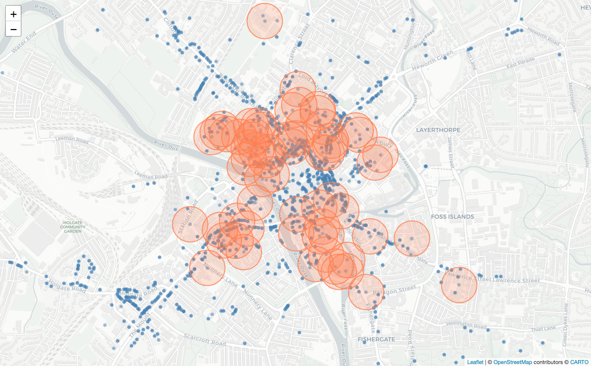
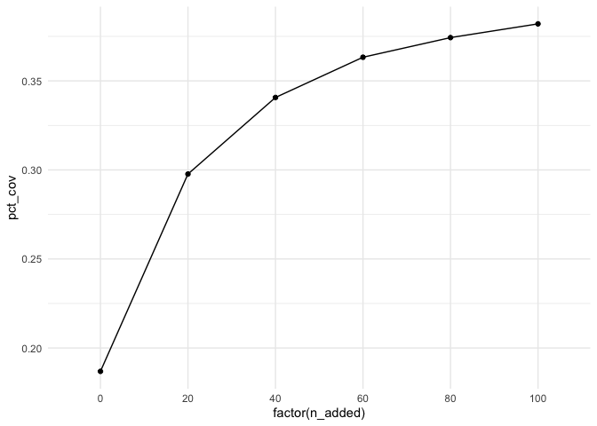

<!-- README.md is generated from README.Rmd. Please edit that file -->

# maxcovr

<!-- badges: start -->

[](https://github.com/njtierney/maxcovr/actions/workflows/R-CMD-check.yaml)
[](https://app.codecov.io/gh/njtierney/maxcovr)
<!-- badges: end -->

maxcovr was created to make it easy for a non expert to correctly solve
the maximum covering location problem described by
[Church](http://www.geog.ucsb.edu/~forest/G294download/MAX_COVER_RLC_CSR.pdf).
Implementations of this problem (such as [optimimum AED
placement](https://www.resuscitationjournal.com/article/S0300-9572(18)30065-0/fulltext))
may use commercial software such as AMPL, Gurobi, or CPLEX, which
require an expensive license, or use open source licenses but not
provide source code to the analysis performed (e.g., [Bonnet
2014](http://www.sciencedirect.com/science/article/pii/S0360835215003927))
This builds a substantial barrier to implement and reproduce these
analyses.

maxcovr was created to make results easy to implement, reproduce, and
extend by using:

- R, a free and open source language
- Open source solvers, glpk and lpSolve, that can be used on Linux,
  Windows, and OSX.
- Real-world, open source example data.
- Tidyverse principles to make it easy to use and reason with.

Please note that this project is released with a [Contributor Code of
Conduct](CONDUCT.md). By participating in this project you agree to
abide by its terms.

# How to Install

Install the development version of `maxcovr` from
[r-universe](http://njtierney.r-universe.dev/):

``` r
install.packages("maxcovr", repos = c("https://njtierney.r-universe.dev", "https://cloud.r-project.org"))
```

(Note - installing from r-universe is just like installing from CRAN,
and should be faster and more convenient than installing from GitHub)

Or install using `remotes`:

``` r
# install.packages("remotes")
remotes::install_github("njtierney/maxcovr")
```

# Using maxcovr

*Disclaimer: The following is a fictitious example using real world
data.*

Consider the toy example where we are playing a tower defense game and
we need to place crime surveillance towers to detect crime.

We have two datasets, `york`, and `york_crime`:

- `york` contains listed building GPS locations in the city of York,
  provided by the city of york
- `york_crime` contains a set of crime data from the [`ukpolice`
  package](https://www.github.com/njtierney/ukpolice), containing crime
  data from September 2016.

In this game we already have a few towers built, which are placed on top
of the listed buildings with a grade of I. We will call this dataset
`york_selected`, and the remaining building locations `york_unselected`

``` r

library(maxcovr)
library(dplyr)
#> 
#> Attaching package: 'dplyr'
#> The following objects are masked from 'package:stats':
#> 
#>     filter, lag
#> The following objects are masked from 'package:base':
#> 
#>     intersect, setdiff, setequal, union

# subset to be the places with towers built on them.
york_selected <- york %>% filter(grade == "I")

york_unselected <- york %>% filter(grade != "I")
```

The purpose of the game is to build towers in places so that they are
within 100m of crime. We are going to use the crime data that we have to
help us choose ideal locations to place towers.

This can be illustrated with the following graphic, where the red
circles indicate the current coverage of the building locations, so
those blue crimes within the circles are within the coverage.

``` r

library(leaflet)

leaflet() %>%
    addCircleMarkers(data = york, 
                     radius = 1,
                     color = "steelblue") %>%
    addCircles(data = york_selected, 
               radius = 100,
               stroke = TRUE,
               fill = NULL,
               opacity = 0.8,
               weight = 2,
               color = "coral") %>%
    addProviderTiles("CartoDB.Positron") %>%
    setView(lng = median(york$long),
            lat = median(york$lat),
            zoom = 15)
#> Assuming "long" and "lat" are longitude and latitude, respectively
#> Assuming "long" and "lat" are longitude and latitude, respectively
```

<!-- -->

Currently the coverage looks alright, but let’s verify the coverage
using the `nearest` function. `nearest` takes two dataframes and returns
the nearest lat/long coords from the first dataframe to the second
dataframe, along with the distances between them and the appropriate
columns from the building dataframe.

``` r

dat_dist <- york_selected %>% nearest(york_crime)

head(dat_dist)
#> # A tibble: 6 × 22
#>   to_id nearest_id distance category          persistent_id date  lat_to long_to
#>   <dbl>      <dbl>    <dbl> <chr>             <chr>         <chr>  <dbl>   <dbl>
#> 1     1         66    166.  anti-social-beha… 62299914865f… 2016…   54.0   -1.08
#> 2     2         48   2087.  anti-social-beha… 4e34f53d247f… 2016…   54.0   -1.12
#> 3     3         55     68.2 anti-social-beha… 2a0062f3dfac… 2016…   54.0   -1.08
#> 4     4         11    286.  anti-social-beha… eb53e09ae46a… 2016…   54.0   -1.09
#> 5     5         25    536.  anti-social-beha… 6139f131b724… 2016…   54.0   -1.08
#> 6     6         20    160.  anti-social-beha… d8de26d5af47… 2016…   54.0   -1.08
#> # ℹ 14 more variables: street_id <chr>, street_name <chr>, context <chr>,
#> #   id <chr>, location_type <chr>, location_subtype <chr>,
#> #   outcome_status <chr>, long_nearest <dbl>, lat_nearest <dbl>,
#> #   object_id <int>, desig_id <chr>, pref_ref <int>, name <chr>, grade <chr>
```

You can instead return a dataframe which has every building in the rows,
and the nearest crime to the building, by simply changing the order.

``` r

dat_dist_bldg <- york_crime %>% nearest(york_selected)
head(dat_dist_bldg)
#> # A tibble: 6 × 22
#>   to_id nearest_id distance long_to lat_to object_id desig_id pref_ref name     
#>   <dbl>      <dbl>    <dbl>   <dbl>  <dbl>     <int> <chr>       <int> <chr>    
#> 1     1         33     36.0   -1.09   54.0      6144 DYO1195    463280 GUILDHAL…
#> 2     2        183     35.8   -1.09   54.0      6142 DYO1373    462942 BOOTHAM …
#> 3     3        503     95.3   -1.08   54.0      3463 DYO365     464845 THE NORM…
#> 4     4        273     44.3   -1.08   54.0      3461 DYO583     464427 CHURCH O…
#> 5     5        908     26.5   -1.08   54.0      3460 DYO916     463764 CUMBERLA…
#> 6     6        495    326.    -1.13   54.0      3450 DYO1525    328614 CHURCH O…
#> # ℹ 13 more variables: grade <chr>, category <chr>, persistent_id <chr>,
#> #   date <chr>, lat_nearest <dbl>, long_nearest <dbl>, street_id <chr>,
#> #   street_name <chr>, context <chr>, id <chr>, location_type <chr>,
#> #   location_subtype <chr>, outcome_status <chr>
```

To evaluate the coverage we can use `coverage`. This reads as find the
coverage of the york buildings (below) to the crimes. Coverage of the
first thing on the second thing. Or, how many of the second thing are
covered by the first thing.

``` r

coverage(york_selected, york_crime)
#> # A tibble: 1 × 7
#>   distance_within n_cov n_not_cov prop_cov prop_not_cov dist_avg dist_sd
#>             <dbl> <int>     <int>    <dbl>        <dbl>    <dbl>   <dbl>
#> 1             100   339      1475    0.187        0.813    1400.   1597.
```

This tells us that out of all the crime, 18.68% of it is within 100m,
339 crimes are covered, but the mean distance to the surveillance camera
is 1400m.

## Maximising coverage

Say then we want to add another 20 surveillance towers, but we want to
use the best 20, we use `max_coverage`.

``` r

system.time(
# mc_20 <- max_coverage(A = dat_dist_indic,
mc_20 <- max_coverage(existing_facility = york_selected,
                      proposed_facility = york_unselected,
                      user = york_crime,
                      n_added = 20,
                      distance_cutoff = 100)
)
#>    user  system elapsed 
#>   0.556   0.032   0.604
```

`max_coverage` actually returns a dataframe of lists.

``` r
mc_20
#> 
#> ------------------------------------------- 
#> Model Fit: maxcovr fixed location model 
#> ------------------------------------------- 
#> model_used:        max_coverage 
#> existing_facility: york_selected 
#> proposed_facility: york_unselected 
#> user:              york_crime 
#> distance_cutoff:   100 
#> n_added:           20 
#> d_existing_user:            lpSolve 
#> -------------------------------------------
```

This is handy because it means that later when you want to explore
multiple `n_added`, say you want to explore how coverage changes for 20,
40, 60, 80, 100 `n_added`, then these are added as rows in the
dataframe, which makes it easier to do summaries and manipulate.

Important features here of this dataframe are:

- `facility_selected`: A dataframe from `proposed_facilities`,
  containing the facilities selected by the optimisation.
- `user_affected`: A dataframe from `user`, that contains the users that
  were affected by the new optimised placement
- `model_coverage`: A dataframe containing summary info on the number of
  users covered, the percentage of coverage, and the average distance.
- `existing_coverage`: returns a similar summary dataframe the original
  coverage, from `existing_facilities`.
- `summary`: returns the binded `model_coverage` and
  `existing_coverage`.
- `n_added`: The number of things added
- `distance_cutoff`: the distance cutoff selected

One can also use `map` from `purrr` to fit many different configurations
of `n_added`. (Future work will look into allowing `n_added` to take a
vector of arguments).

``` r
library(purrr)
n_add_vec <- c(20, 40, 60, 80, 100)

system.time(
map_mc_model <- map_df(.x = n_add_vec,
                       .f = ~max_coverage(existing_facility = york_selected,
                                          proposed_facility = york_unselected,
                                          user = york_crime,
                                          distance_cutoff = 100,
                                          n_added = .))
)
#>    user  system elapsed 
#>   1.848   0.085   1.940
```

This returns a list of dataframes, which we can bind together like so:

``` r

map_cov_results <- bind_rows(map_mc_model$model_coverage)
```

We can then visualise the effect on coverage:

``` r
library(ggplot2)
bind_rows(map_mc_model$existing_coverage[[1]],
          map_cov_results) %>%
    ggplot(aes(x = factor(n_added),
               y = pct_cov)) + 
    geom_point() +
    geom_line(group = 1) + 
    theme_minimal()
```

<!-- -->

You can read more about the use of `max_coverage`, covering topics like
cross validation in the vignette.

# Known Issues

- `max_coverage()` may take a bit of time to run, depending on your data
  size. From initial testing, if the product of the number of rows of
  the `proposed_facilities` and `users` exceeds 100 million, it might
  take more than 1 minute. Of course, this may depend on the structure /
  complexity of your data and problem.

- The distances calculated in `maxcovr` use [haversines
  formula](https://en.wikipedia.org/wiki/Haversine_formula), which makes
  the assumption that the earth is a sphere and calculates the greater
  circle distance. Whilst not wholly correct, haversine is a useful
  approximation that is reasonable for small scale distances, where the
  accuracy can be within metres which is what `maxcovr` was initially
  built for. In the future `maxcovr` will use more accurate distance
  functions provided in
  [`geodist`](https://github.com/hypertidy/geodist), and give the user
  control over the distance calculation used (haversines, vincenty,
  cheap ruler, geodesic, etc).

# Future Work

I will be focussing on making `maxcovr` work well within the
`tidyverse`. This includes providing sensible standard summaries using
key function verbs from `broom`, adding exploratory plots, improving
speed using Rcpp, and allowing users to select the solver they want to
use.

If you have any suggestions, please [file an
issue](http://www.github.com/njtierney/maxcovr/issues/new) and I will
get to it as soon as I can.

# Code of Conduct

Please note that this project is released with a [Contributor Code of
Conduct](.github/CODE_OF_CONDUCT.md).

By participating in this project you agree to abide by its terms.

# Acknowledgements

Oliver Czibula, for this initial help in helping me understand the
Maximum Covering Location Problem. Angelo Auricchio and Antonietta Mira
for their supervision. Alessio Quaglino and Jost Reinhold for their help
in implementing the first implementation of this problem in lpSolve.
Martin Weiser for his suggestion for the relocation process. Matt Sutton
for his very thoughtful explanations on how to interact with high level
solvers, which led to implementing maxcovr in lpsolve, glpk, and gurobi.
And Alex Simmons, for teaching me how to write better C++ code.
