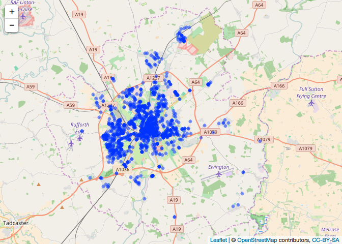

<!-- README.md is generated from README.Rmd. Please edit that file -->
maxcovr
=======

[](https://ci.appveyor.com/project/njtierney/maxcovr)[](https://travis-ci.org/njtierney/maxcovr)

maxcovr provides tools to make it easy to solve the "maximum covering location problem", a binary optimisation problem described by [Church](http://www.geog.ucsb.edu/~forest/G294download/MAX_COVER_RLC_CSR.pdf). Currently it uses the `lp` solver from the `lpsolve` package.

How to Install
==============

``` r

# install.packages("devtools")
devtools::install_github("njtierney/maxcovr")
library(maxcovr)
```

<!-- # Example Usage -->
<!-- Need to find a good example dataset to use here -->
Usage
=====

We use the `york` data to obtain building locations, and then take a set of crime data from the [`ukpolice` package](https://www.github.com/njtierney/ukpolice)

``` r
library(maxcovr)
# install.packages("tidyverse")
library(tidyverse)
#> Loading tidyverse: ggplot2
#> Loading tidyverse: tibble
#> Loading tidyverse: tidyr
#> Loading tidyverse: readr
#> Loading tidyverse: purrr
#> Loading tidyverse: dplyr
#> Conflicts with tidy packages ----------------------------------------------
#> filter(): dplyr, stats
#> lag():    dplyr, stats
# install.packages("leaflet")
library(leaflet)
# devtools::install_github("njtierney/ukpolice")
library(ukpolice)


york %>%
    leaflet() %>%
    addTiles() %>%
    addCircleMarkers(popup = ~name)
#> Assuming 'long' and 'lat' are longitude and latitude, respectively
```


``` r

york_poly <- ukp_geo_chull(york, lat, long)

york_crime <- ukp_crime_poly(poly = york_poly)
#> Warning in mutate_impl(.data, dots): '.Random.seed' is not an integer
#> vector but of type 'NULL', so ignored
#> No encoding supplied: defaulting to UTF-8.

york_crime %>%
    leaflet() %>%
    addTiles() %>%
    addCircles()
#> Assuming 'long' and 'lat' are longitude and latitude, respectively
```



Say, for arguments sake, that we are interested in turning some listed buildings into police stations. We might be interested in those buildings that are within 200m of a crime location. We can use the `facility_user_dist()` function, which takes two dataframes with columns named "lat" and "long", and uses haverines formula to calculate the distance between them. At this stage both dataframes need to have the named columns "lat" and "long".

``` r

york_distance <- facility_user_dist(facility = york,
                                    user = york_crime,
                                    coverage_distance = 200,
                                    nearest = "facility")
```

This does joins the york building dataset with the crime dataset and adds columns to identify the buildings and the crimes. The "nearest" option can be "facility", "user", and "both". Defaults to "facility". When set to "facility", returns a dataframe where every row is every crime, and the closest building to each crime. When set to "user", returns a dataframe where every row is every building, and the closest crime to each building. set to "both", which will return every pairwise combination of distances. Be careful whenDefault is "facility".

``` r

head(york_distance)
#> # A tibble: 6 × 23
#>                category
#>                   <chr>
#> 1 anti-social-behaviour
#> 2 anti-social-behaviour
#> 3 anti-social-behaviour
#> 4         bicycle-theft
#> 5          public-order
#> 6 theft-from-the-person
#> # ... with 22 more variables: persistent_id <chr>, date <chr>,
#> #   lat_user <dbl>, long_user <dbl>, street_id <chr>, street_name <chr>,
#> #   context <chr>, id <chr>, location_type <chr>, location_subtype <chr>,
#> #   outcome_status <chr>, user_id <int>, long_facility <dbl>,
#> #   lat_facility <dbl>, object_id <int>, desig_id <chr>, pref_ref <int>,
#> #   name <chr>, grade <chr>, facility_id <int>, distance <dbl>,
#> #   is_covered <lgl>
```

The `coverage()` function calculates the coverage on the distance data frame. Here, we see that about 50% of listed buildings are within 100m of a crime.

``` r

coverage(york_distance,
         dist_indic = 100,
         spread = TRUE)
#> # A tibble: 1 × 5
#>   distance_within n_cov   pct_cov n_not_cov pct_not_cov
#>             <dbl> <int>     <dbl>     <int>       <dbl>
#> 1             100   883 0.4988701       887   0.5011299
```

You can also use `group_by` syntax from `dplyr` to get different information. Say for example, if you want to calculate the coverage for each crime category.

``` r

york_distance %>%
    group_by(category) %>%
    coverage()
#> # A tibble: 14 × 6
#>                 category distance_within n_cov     pct_cov n_not_cov
#>                    <chr>           <dbl> <int>       <dbl>     <int>
#> 1  anti-social-behaviour             100   410 0.231638418       425
#> 2          bicycle-theft             100    56 0.031638418        26
#> 3               burglary             100    38 0.021468927        44
#> 4  criminal-damage-arson             100    49 0.027683616        58
#> 5                  drugs             100    17 0.009604520        17
#> 6            other-crime             100     9 0.005084746         5
#> 7            other-theft             100    63 0.035593220        47
#> 8  possession-of-weapons             100     3 0.001694915         3
#> 9           public-order             100    27 0.015254237        22
#> 10               robbery             100     4 0.002259887         2
#> 11           shoplifting             100    60 0.033898305        45
#> 12 theft-from-the-person             100    20 0.011299435         3
#> 13         vehicle-crime             100    23 0.012994350        43
#> 14         violent-crime             100   104 0.058757062       147
#> # ... with 1 more variables: pct_not_cov <dbl>
```

Known Issues
============

-   `facility_user_dist()` is currently very slow, as it requires calculating the pairwise combination of every distance, and then subsetting based on what is closest. Future work is investigating faster, more sensible approaches.
-   `max_coverage()` may take a bit of time to run, depending on your data size. If the product of your pairwise distance matrix exceeds 1 billion rows, it might take more than 1 minute.

`maxcovr` is still in beta, so there are likely to be unidentified bugs, please keep this in mind!

Future Work
===========

At the moment `max_coverage` uses the solver lpSolve, which is not as fast as other solvers such as CPLEX or Gurobi. In the future I will be providing alternative interfaces to other solvers, potentially using something like [`ompr`](https://github.com/dirkschumacher/ompr), to give users their own choice of solver, such as glpk, CPLEX, or Gurobi. A Gurobi interface is currently under development.

I also aim to provide functions that simplify the data common transformations (such as summaries of current coverage) when working with these kinds of problems, focussing on keeping the work in a dataframe, improvement in coverage, and more. Also on the cards are some standardized plots for exploration of data and results. If you have any suggestions, please file an issue and I will get to it as soon as I can.

Code of Conduct
===============

Please note that this project is released with a [Contributor Code of Conduct](CONDUCT.md). By participating in this project you agree to abide by its terms.
