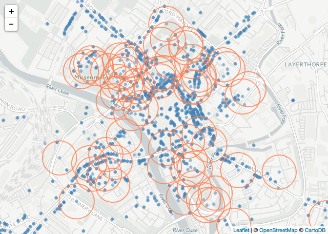
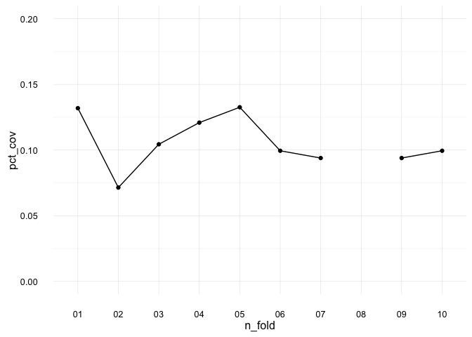
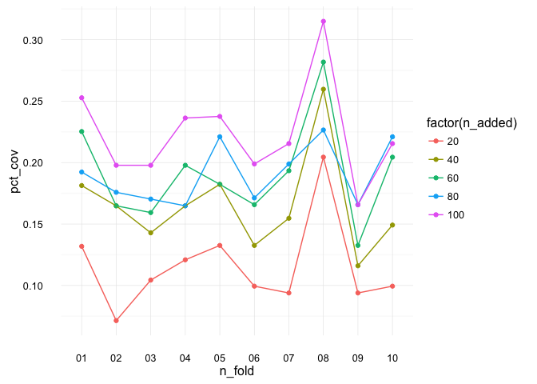
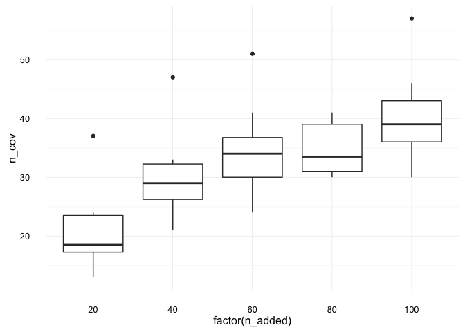
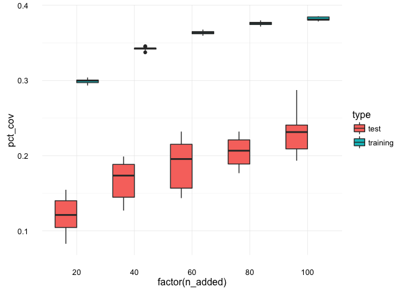

<!-- README.md is generated from README.Rmd. Please edit that file -->
maxcovr
=======

[](https://ci.appveyor.com/project/njtierney/maxcovr)[](https://travis-ci.org/njtierney/maxcovr)[](https://codecov.io/github/njtierney/maxcovr?branch=master)

maxcovr provides tools to make it easy to solve the "maximum covering location problem", a binary optimisation problem described by [Church](http://www.geog.ucsb.edu/~forest/G294download/MAX_COVER_RLC_CSR.pdf). Currently it uses the `lp` solver from the `lpsolve` package.

How to Install
==============

``` r

# install.packages("devtools")
devtools::install_github("njtierney/maxcovr")
```

Usage
=====

Disclaimer: The following is a fictitious example using real world data.

Consider the toy example where we are playing a tower defense game and we need to place crime surveillance towers to detect crime.

We have two datasets, `york`, and `york_crime`:

-   `york` contains listed building GPS locations in the city of York, provided by the city of york
-   `york_crime` contains a set of crime data from the [`ukpolice` package](https://www.github.com/njtierney/ukpolice), containing crime data from September 2016.

In this game we already have a few towers built, which are placed on top of the listed buildings with a grade of I. We will call this dataset `york_selected`, and the remaining building locations `york_unselected`

``` r

library(maxcovr)
library(tidyverse)
#> Loading tidyverse: ggplot2
#> Loading tidyverse: tibble
#> Loading tidyverse: tidyr
#> Loading tidyverse: readr
#> Loading tidyverse: purrr
#> Loading tidyverse: dplyr
#> Conflicts with tidy packages ----------------------------------------------
#> filter(): dplyr, stats
#> lag():    dplyr, stats

# subset to be the places with towers built on them.
york_selected <- york %>% filter(grade == "I")

york_unselected <- york %>% filter(grade != "I")
```

The purpose of the game is to build towers in places so that they are within 100m of crime. We are going to use the crime data that we have to help us choose ideal locations to place towers.

This can be illustrated with the following graphic, where the red circles indicate the current coverage of the building locations.

``` r

library(leaflet)

leaflet() %>%
    addCircleMarkers(data = york, 
                     radius = 1,
                     color = "steelblue") %>%
    addCircles(data = york_selected, 
               radius = 100,
               stroke = TRUE,
               fill = NULL,
               opacity = 0.8,
               weight = 2,
               color = "coral") %>%
    # addTiles() %>%
    addProviderTiles("CartoDB.Positron") %>%
    setView(lng = median(york$long),
            lat = median(york$lat),
            zoom = 15)
#> Assuming 'long' and 'lat' are longitude and latitude, respectively
#> Assuming 'long' and 'lat' are longitude and latitude, respectively
```



Currently the coverage looks alright, but we are pretty zoomed in here.

Let's get a better look at the coverage by looking using the `nearest` function. `nearest` take two dataframes, and returns the nearest lat/long coords from the first dataframe to the second dataframe, along with the distances between them and the appropriate columns from the building dataframe.

``` r

dat_dist <- york_selected %>% nearest(york_crime)

head(dat_dist)
#> # A tibble: 6 × 22
#>   to_id nearest_id   distance              category
#>   <dbl>      <dbl>      <dbl>                 <chr>
#> 1     1         66  165.85752 anti-social-behaviour
#> 2     2         48 2086.76298 anti-social-behaviour
#> 3     3         55   68.23116 anti-social-behaviour
#> 4     4         11  286.34132 anti-social-behaviour
#> 5     5         25  535.78713 anti-social-behaviour
#> 6     6         20  159.90888 anti-social-behaviour
#> # ... with 18 more variables: persistent_id <chr>, date <chr>,
#> #   lat_to <dbl>, long_to <dbl>, street_id <chr>, street_name <chr>,
#> #   context <chr>, id <chr>, location_type <chr>, location_subtype <chr>,
#> #   outcome_status <chr>, long_nearest <dbl>, lat_nearest <dbl>,
#> #   object_id <int>, desig_id <chr>, pref_ref <int>, name <chr>,
#> #   grade <chr>
```

You can instead return a dataframe which has every building in the rows, and the nearest crime to the building, by simply changing the order.

``` r

dat_dist_bldg <- york_crime %>% nearest(york_selected)
head(dat_dist_bldg)
#> # A tibble: 6 × 22
#>   to_id nearest_id  distance   long_to   lat_to object_id desig_id
#>   <dbl>      <dbl>     <dbl>     <dbl>    <dbl>     <int>    <chr>
#> 1     1         33  35.95383 -1.085647 53.95965      6144  DYO1195
#> 2     2        183  35.79129 -1.085433 53.96776      6142  DYO1373
#> 3     3        503  95.34739 -1.083081 53.96131      3463   DYO365
#> 4     4        273  44.28661 -1.080678 53.95818      3461   DYO583
#> 5     5        908  26.51255 -1.082697 53.95686      3460   DYO916
#> 6     6        495 325.87131 -1.134198 54.00190      3450  DYO1525
#> # ... with 15 more variables: pref_ref <int>, name <chr>, grade <chr>,
#> #   category <chr>, persistent_id <chr>, date <chr>, lat_nearest <dbl>,
#> #   long_nearest <dbl>, street_id <chr>, street_name <chr>, context <chr>,
#> #   id <chr>, location_type <chr>, location_subtype <chr>,
#> #   outcome_status <chr>
```

To evaluate the coverage we can use `summarise_coverage`

``` r

dat_dist %>% 
    mutate(is_covered = distance <= 100) %>%
    summarise_coverage()
#> # A tibble: 1 × 7
#>   distance_within n_cov   pct_cov n_not_cov pct_not_cov dist_avg  dist_sd
#>             <dbl> <int>     <dbl>     <int>       <dbl>    <dbl>    <dbl>
#> 1             100   339 0.1868798      1475   0.8131202 1400.192 1596.676
```

This tells us that out of all the crime, 18.68% of it is within 100m, 339 crimes are covered, but the mean distance to the surveillance camera is 1400m.

Maximising coverage
-------------------

Say then we want to add another 20 surveillance towers, but we want to use the best 20, we use `max_coverage`.

``` r

system.time(
# mc_20 <- max_coverage(A = dat_dist_indic,
mc_20 <- max_coverage(existing_facility = york_selected,
                      proposed_facility = york_unselected,
                      user = york_crime,
                      n_added = 20,
                      distance_cutoff = 100)
)
#>    user  system elapsed 
#>   1.750   0.170   1.947
```

If you want to find the improvement in coverage from the original state we do the following:

One can also use `map` from `purrr` to fit many different configurations of `n_added`. (Future work will look into allowing `n_added` to take a vector of arguments).

``` r
library(purrr)

n_add_vec <- c(20, 40, 60, 80, 100)

system.time(
map_mc_model <- map_df(.x = n_add_vec,
                       .f = ~max_coverage(existing_facility = york_selected,
                                          proposed_facility = york_unselected,
                                          user = york,
                                          distance_cutoff = 100,
                                          n_added = .))
)
#>    user  system elapsed 
#>  13.700   0.940  14.887
```

This returns a list of dataframes, which we can bind together like so:

``` r

map_cov_results <- bind_rows(map_mc_model$model_coverage)
```

We can then visualise the effect on coverage:

``` r

bind_rows(map_mc_model$existing_coverage[[1]],
          map_cov_results) %>%
    ggplot(aes(x = factor(n_added),
               y = pct_cov)) + 
    geom_point() +
    geom_line(group = 1) + 
    theme_minimal()
```


performing cross validation on max\_coverage
============================================

Thanks to the `modelr` package, it is relatively straightforward to perform cross validation.

``` r
# first we partition the data into 10 folds
library(modelr)
mc_cv <- modelr::crossv_kfold(york_crime, 10) %>% 
    # we change the test and train sets from the `resample`
    # to tibbles
    mutate(test = map(test,as_tibble),
           train = map(train,as_tibble))
```

This creates a dataframe with test and training sets

``` r

mc_cv
#> # A tibble: 10 × 3
#>                    train                test   .id
#>                   <list>              <list> <chr>
#> 1  <tibble [1,632 × 12]> <tibble [182 × 12]>    01
#> 2  <tibble [1,632 × 12]> <tibble [182 × 12]>    02
#> 3  <tibble [1,632 × 12]> <tibble [182 × 12]>    03
#> 4  <tibble [1,632 × 12]> <tibble [182 × 12]>    04
#> 5  <tibble [1,633 × 12]> <tibble [181 × 12]>    05
#> 6  <tibble [1,633 × 12]> <tibble [181 × 12]>    06
#> 7  <tibble [1,633 × 12]> <tibble [181 × 12]>    07
#> 8  <tibble [1,633 × 12]> <tibble [181 × 12]>    08
#> 9  <tibble [1,633 × 12]> <tibble [181 × 12]>    09
#> 10 <tibble [1,633 × 12]> <tibble [181 × 12]>    10
```

We then fit the model on the training set using `map_df`

``` r

# then we fit the model
system.time(
    mc_cv_fit <- map_df(mc_cv$train,
                     ~max_coverage(existing_facility = york_selected,
                                   proposed_facility = york_unselected,
                                   user = ., # training set goes here
                                   n_added = 20,
                                   distance_cutoff = 100))
)
#>    user  system elapsed 
#>  12.727   1.096  13.955
```

Then we can use the `summary_mc_cv` function to extract out the summaries from each fold. This summary takes the facilities placed using the training set of users, and then takes the test set of users and counts what percent of these are being covered by the training model.

``` r

summarised_cv <- summary_mc_cv(mc_cv_fit, mc_cv)

summarised_cv %>% knitr::kable()
```

|  n\_added| n\_fold |  distance\_within|  n\_cov|   pct\_cov|  n\_not\_cov|  pct\_not\_cov|  dist\_avg|   dist\_sd|
|---------:|:--------|-----------------:|-------:|----------:|------------:|--------------:|----------:|----------:|
|        20| 01      |               100|      26|  0.1428571|          156|      0.8571429|  1386.7895|  1815.0866|
|        20| 02      |               100|      21|  0.1153846|          161|      0.8846154|  1258.6292|  1549.4160|
|        20| 03      |               100|      19|  0.1043956|          163|      0.8956044|  1293.6325|  1676.3622|
|        20| 04      |               100|      24|  0.1318681|          158|      0.8681319|  1435.7361|  1812.9066|
|        20| 05      |               100|      15|  0.0828729|          166|      0.9171271|  1278.8781|  1804.4648|
|        20| 06      |               100|      27|  0.1491713|          154|      0.8508287|   956.4925|   973.4245|
|        20| 07      |               100|      23|  0.1270718|          158|      0.8729282|   921.9236|  1188.4502|
|        20| 08      |               100|      28|  0.1546961|          153|      0.8453039|  1082.6999|  1389.3083|
|        20| 09      |               100|      17|  0.0939227|          164|      0.9060773|  1118.0887|  1394.5509|
|        20| 10      |               100|      19|  0.1049724|          162|      0.8950276|  1247.7385|  1552.6097|

Eyeballing the values, it looks like the pct coverage stays around 10%, but we can plot it to get a better idea. We can overlay the coverage obtained using the full dataset to get an idea of how we are performing.

``` r

summarised_cv %>%
    ggplot(aes(x = n_fold,
               y = pct_cov)) + 
    geom_point() +
    geom_line(group = 1) + 
    theme_minimal()
```



Here we see that the pct\_coverage doesn't seem to change much across the folds.

Coming up next, we will explore how to perform cross validation as we increase the number of facilities added.

Ideally, there should be a way to do this using purrr, so we don't have to fic 5 separate models, but perhaps this will change when we enable n\_added to take a vector of values.

``` r

# then we fit the model
system.time(
    mc_cv_fit_n20 <- map_df(mc_cv$train,
                     ~max_coverage(existing_facility = york_selected,
                                   proposed_facility = york_unselected,
                                   user = ., # training set goes here
                                   n_added = 20,
                                   distance_cutoff = 100))
)
#>    user  system elapsed 
#>  12.641   0.979  13.699

system.time(
    mc_cv_fit_n40 <- map_df(mc_cv$train,
                     ~max_coverage(existing_facility = york_selected,
                                   proposed_facility = york_unselected,
                                   user = ., # training set goes here
                                   n_added = 40,
                                   distance_cutoff = 100))
)
#>    user  system elapsed 
#>  12.692   0.988  13.740

system.time(
    mc_cv_fit_n60 <- map_df(mc_cv$train,
                     ~max_coverage(existing_facility = york_selected,
                                   proposed_facility = york_unselected,
                                   user = ., # training set goes here
                                   n_added = 60,
                                   distance_cutoff = 100))
)
#>    user  system elapsed 
#>  12.497   1.036  13.641
system.time(
    mc_cv_fit_n80 <- map_df(mc_cv$train,
                     ~max_coverage(existing_facility = york_selected,
                                   proposed_facility = york_unselected,
                                   user = ., # training set goes here
                                   n_added = 80,
                                   distance_cutoff = 100))
)
#>    user  system elapsed 
#>  12.986   1.191  15.570
system.time(
    mc_cv_fit_n100 <- map_df(mc_cv$train,
                     ~max_coverage(existing_facility = york_selected,
                                   proposed_facility = york_unselected,
                                   user = ., # training set goes here
                                   n_added = 100,
                                   distance_cutoff = 100))
)
#>    user  system elapsed 
#>  12.905   1.158  14.228
```

``` r

summarised_cv_n20 <- summary_mc_cv(mc_cv_fit_n20, mc_cv)
summarised_cv_n40 <- summary_mc_cv(mc_cv_fit_n40, mc_cv)
summarised_cv_n60 <- summary_mc_cv(mc_cv_fit_n60, mc_cv)
summarised_cv_n80 <- summary_mc_cv(mc_cv_fit_n80, mc_cv)
summarised_cv_n100 <- summary_mc_cv(mc_cv_fit_n100, mc_cv)

bound_testing_summaries <- bind_rows(summarised_cv_n20,
                                     summarised_cv_n40,
                                     summarised_cv_n60,
                                     summarised_cv_n80,
                                     summarised_cv_n100) %>%
    mutate(type = "test")
```

It looks like the more facilities we add, the better the coverage...mostly.

``` r
bound_training_summaries <- bind_rows(mc_cv_fit_n20$model_coverage,
                                      mc_cv_fit_n40$model_coverage,
                                      mc_cv_fit_n60$model_coverage,
                                      mc_cv_fit_n80$model_coverage,
                                      mc_cv_fit_n100$model_coverage) %>%
    mutate(type = "training")

bound_all_summaries <- bind_rows(bound_testing_summaries,
                                 bound_training_summaries)
```

``` r

ggplot(bound_testing_summaries,
       aes(x = n_fold,
               y = pct_cov,
               colour = factor(n_added),
               group = factor(n_added))) + 
    geom_point() + 
    geom_line() + 
    theme_minimal()
```



Let's look at this another way, with boxplots for the number of facilities added.

``` r

ggplot(bound_testing_summaries,
       aes(x = factor(n_added),
           y = n_cov)) +
    geom_boxplot() + 
    theme_minimal()
```



We can also compare the % coverage for the test and training datasets

``` r

bound_all_summaries %>%
    ggplot(aes(x = factor(n_added),
               y = pct_cov,
               fill = type)) + 
    geom_boxplot() + 
    theme_minimal()
```



Known Issues
============

-   `max_coverage()` may take a bit of time to run, depending on your data size. From initial testing, if the product of the number of rows of the `proposed_facilities` and `users` exceeds 100 million, it might take more than 1 minute. Of course, this may depend on the structure / complexity of your data and problem.

Future Work
===========

Through December 2016 I will be focussing on making `maxcovr` more usable, building in better summaries into the model fitting process, keeping the work in a dataframe, adding speed improvements using c++ where possible, and implementing an optional gurobi solver. I will also be creating standardized plots for exploration of data and results.

In 2017 I will be providing alternative interfaces to other solvers, potentially using something like [`ompr`](https://github.com/dirkschumacher/ompr), to give users their own choice of solver, such as glpk or CPLEX. In this time I will also be looking into exploiting embarassingly parallel features for data preprocessing.

``` r
# 
# n_add_vec <- c(20,40)
# 
# system.time(
#     mc_cv_fit_many <- 
#         map2_df(mc_cv$train, # training set goes here
#                 n_add_vec,
#                 .f = ~max_coverage,
#                 existing_facility = york_selected,
#                 proposed_facility = york_unselected,
#                 distance_cutoff = 100)
# )
# 
# 
# system.time(
#     mc_cv_fit_many <- 
#         pmap(.l = list(user = mc_cv$train, # training set goes here
#                        n_added = n_add_vec),
#              .f = ~max_coverage,
#              existing_facility = york_selected,
#              proposed_facility = york_unselected,
#              distance_cutoff = 100)
# )
```

If you have any suggestions, please file an issue and I will get to it as soon as I can.

Code of Conduct
===============

Please note that this project is released with a [Contributor Code of Conduct](CONDUCT.md). By participating in this project you agree to abide by its terms.
